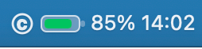
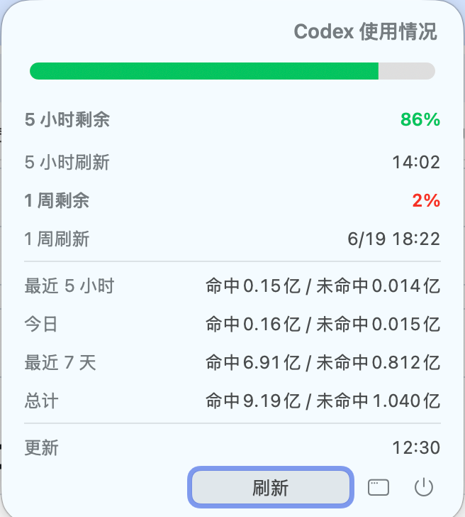
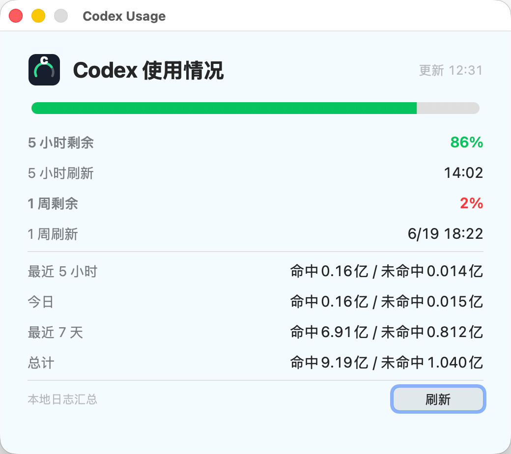

# Codex Usage Monitor for macOS

一个本地 macOS 菜单栏工具，用来查看 Codex 使用情况和剩余额度。

当前主功能是菜单栏常驻显示，例如：

```text
[Codex 标识 + 彩色电量条] 64% 14:02
```

点击菜单栏项目后可以查看：

- 5 小时窗口剩余额度和刷新时间
- 7 天窗口剩余额度和刷新时间
- 最近 5 小时、今天、最近 7 天、累计 token 统计，并区分命中缓存和未命中缓存
- 紧凑的彩色进度条，颜色随剩余额度变化

## 效果图

菜单栏常驻状态：



| 菜单栏展开面板 | 主窗口 |
| --- | --- |
|  |  |

## 数据来源

工具只读取本机 Codex 日志：

```text
~/.codex/sessions/**/*.jsonl
~/.codex/archived_sessions/**/*.jsonl
```

不会读取 `~/.codex/auth.json`，也不会上传任何 Codex 日志或 token 数据。

## 安装

在项目目录执行：

```sh
./Scripts/install.sh
```

安装脚本会：

- 构建菜单栏 App 和后台采集器
- 优先安装到 `/Applications/Codex Usage.app`
- 注册后台刷新任务
- 启动菜单栏常驻项
- 生成 App 图标

安装后会创建两个 LaunchAgent：

```text
~/Library/LaunchAgents/com.gukai.CodexUsage.collector.plist
~/Library/LaunchAgents/com.gukai.CodexUsage.menubar.plist
```

后台采集器每 60 秒刷新一次，并写入：

```text
~/Library/Application Support/CodexUsage/usage_summary.json
```

## 手动刷新

点击菜单栏项目展开面板，然后点击：

```text
刷新
```

## 打开主窗口

从展开面板点击窗口图标，或直接打开：

```text
/Applications/Codex Usage.app
```

主窗口使用和展开面板一致的 dashboard 设计，适合停靠查看。

## 卸载

```sh
./Scripts/uninstall.sh
```

保留本地 `usage_summary.json` 等支持数据：

```sh
./Scripts/uninstall.sh --keep-data
```

## 重装

```sh
./Scripts/reinstall.sh
```

## 构建

当前安装包使用 Objective-C/AppKit 作为菜单栏主体：

```sh
./Scripts/build-objc.sh
./Scripts/install.sh
```

Swift/WidgetKit 源码保留在：

```text
Sources/CodexUsageCore
Sources/CodexUsageWidgets
Sources/CodexUsageMenuBar
```

小组件功能不是当前主发布目标，菜单栏版本可以独立使用。

## 代码仓库

本目录是独立 Git 仓库，配置两个远端：

```text
origin  https://gitcode.com/jumpgu/codex-usage-monitor.git
github  https://github.com/jumpgu/codex-usage-monitor.git
```

常规同步：

```sh
git push origin main --tags
git push github main --tags
```

## 已知说明

- reset 时间来自 Codex 本地 `token_count` 事件里的 rate limit 数据。
- 如果最近的 5 小时窗口 reset 时间已经过期，工具会按当前本地窗口做兜底修正，避免显示旧窗口时间。
- 菜单栏显示的是剩余额度，不是已用额度。
- 小组件代码仍保留在仓库中，但当前发布目标是 macOS 菜单栏版本。
